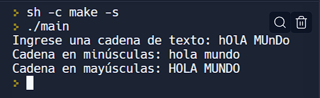

# Práctica 1.2 Punteros
### Daniel Tejeda Saavedra 22310431 CETI COLOMOS

# Codigo1: Minusculas y Mayusculas

```c++
//Daniel Tejeda Saavedra 22310431
#include <iostream>
#include <string>

using namespace std;


string a_mayus(string str) {
  for (int i = 0; str[i]; i++)
    str[i] = str[i] >= 'a' && str[i] <= 'z' ? str[i] - 32 : str[i];

  return str;
}

string a_minus(string str) {
  for (int i = 0; str[i]; i++)
    str[i] = str[i] >= 'A' && str[i] <= 'Z' ? str[i] + 32 : str[i];

  return str;
}

int main() {
    string cadena;
    cout << "Ingrese una cadena de texto: ";
    getline(cin, cadena);

    cout << "Cadena en minúsculas: " << a_minus(cadena) << endl;

    cout << "Cadena en mayúsculas: " << a_mayus(cadena) << endl;

    return 0;
}
```
## Resultados Codigo 1:


# Codigo2: Cifrado Cesar
```c++
//Daniel Tejeda Saavedra 22310431
#include <cmath>
#include <iostream>
#include <string>

using namespace std;

bool es_primo(int n) {
  if (n <= 1)
    return false;

  for (int i = 2; i <= sqrt(n); i++)
    if (!(n % i))
      return false;

  return true;
}

string cifrar(string mensaje, int clave) {
  string cifrado = "";
  // cif += ((c - 'A' + clave) % 26) + 'A'; Mayusculas
  for (char c : mensaje)
    cifrado = c >= 'a' &&c <= 'z' 
              ? cifrado += ((c - 'a' + clave) % 26) + 'a'
              : cifrado += c;

  return cifrado;
}

string descifrar(string cifrado, int clave) {
  string mensaje = "";
  // mes += (char) ((c - 'A' - clave) % 26) + 'A'; Mayusculas

  for (char c : cifrado)
    mensaje = c >= 'a' &&c <= 'z'
                  ? mensaje += ((c - 'a' + (26 - clave)) % 26) + 'a'
                  : mensaje += c;

  return mensaje;
}

string a_minusculas(string cadena) {
  for (int i = 0; cadena[i]; i++)
    cadena[i] = cadena[i] >= 'A' && cadena[i] <= 'Z' ? cadena[i] + 32 : cadena[i];

  return cadena;
}

int main() {
  int clave;
  string mensaje, cifrado, descifrado;
  cout << "Ingrese la clave (un número primo): ";
  cin >> clave;
  if (!es_primo(clave)) {
    cout << "La clave debe ser un número primo." << endl;
    return 1;
  }
  cin.ignore();
  cout << "Ingrese el mensaje: ";
  getline(cin, mensaje);
  cifrado = cifrar(a_minusculas(mensaje), clave);
  cout << "Mensaje cifrado: " << cifrado << endl;
  descifrado = descifrar(cifrado, clave);
  cout << "Mensaje descifrado: " << descifrado << endl;
  return 0;
}
```

## Resultados Codigo 2:


# Codigo 3: Ordenamiento Burbuja
```c++
//Daniel Tejeda Saavedra
#include <iostream>

using namespace std;

void leer_arreglo(int *arreglo, int n) {
    for (int i = 0; i < n; i++) {
        cout << "Ingrese el elemento " << i << " del arreglo: ";
        cin >> *(arreglo + i);
    }
}

void burbuja(int *arr, int n){
  for (int i = 0; i < n - 1; i++)
    for (int j = 0; j < n - i - 1; j++)
      if (*(arr + j) > *(arr + j + 1)) 
        *(arr + j)^=*(arr + j + 1)^(*(arr + j + 1)=*(arr + j));
}

void imprimir_arreglo(int arr[]) {
    for (int i = 0; arr[i]; i++)
        cout << arr[i] << ", ";
    cout<<endl;
}

int main() {
    int arreglo[10];
    leer_arreglo(arreglo, 10);
    cout<<"Arreglo Original: ";
    imprimir_arreglo(arreglo);
    burbuja(arreglo, 10);
    cout<<"Arreglo Ordenado: ";
    imprimir_arreglo(arreglo);
    return 0;
}
```

## Resultados Codigo 3:
